# 吉商城-移动端项目

Gemall：

移动端：Flutter框架

前端：Vue + Arco design pro框架开发

后端：SpringBoot

## 项目地址

* [Gemall-backend 后端](https://github.com/MA-douzhang/GeMall-backend)
* [Gemall-frontend 前端管理](https://github.com/MA-douzhang/Gemall-frontend)
* [GeTeamBuy 移动端](https://github.com/MA-douzhang/GeTeamBuy)

## 借鉴项目
* [litemall项目](https://github.com/linlinjava/litemall)
* [new_flutter_mallprovider项目](https://github.com/lotawei/new_flutter_mallprovider)

## 项目展示

后端管理界面

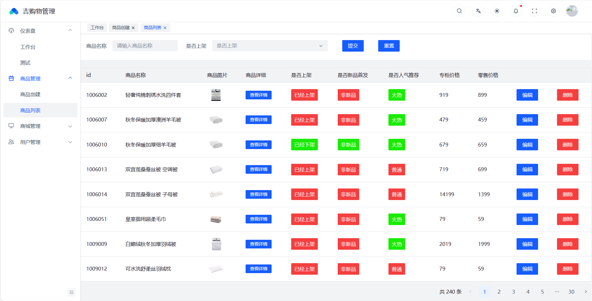
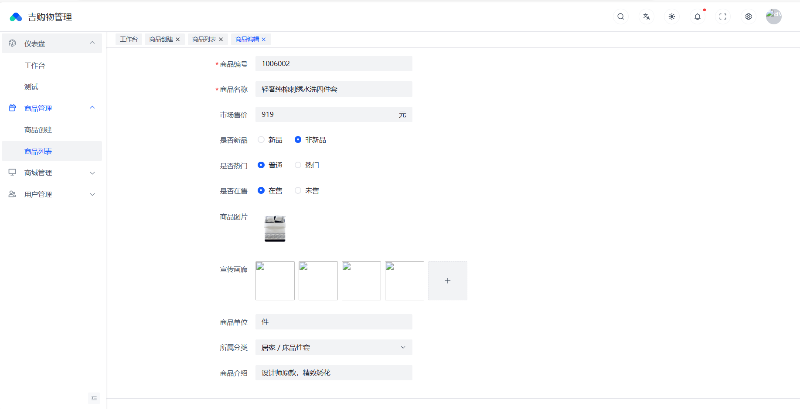
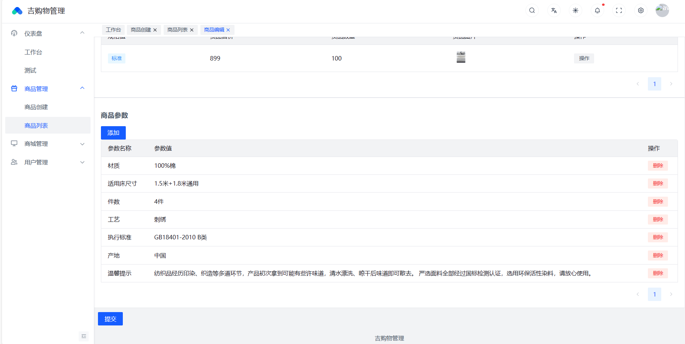
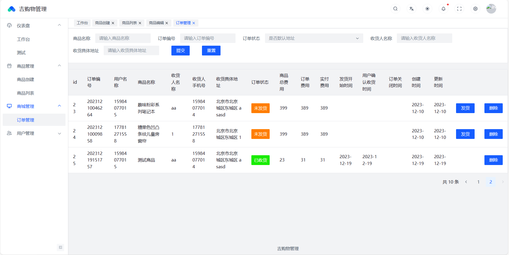
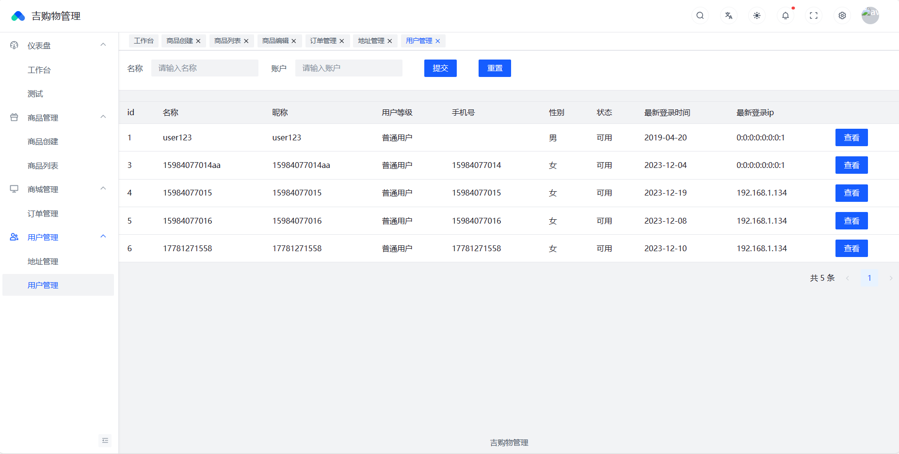

移动端界面

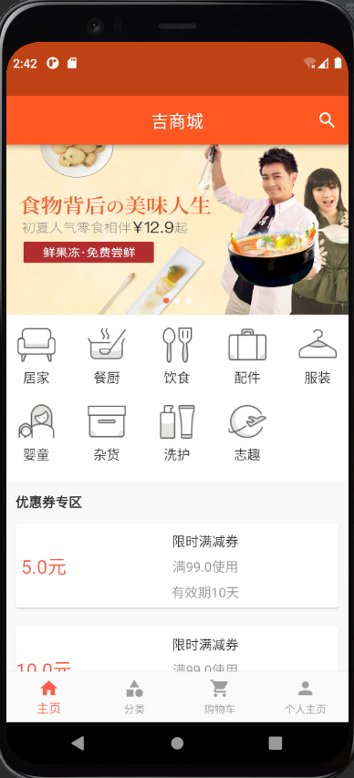
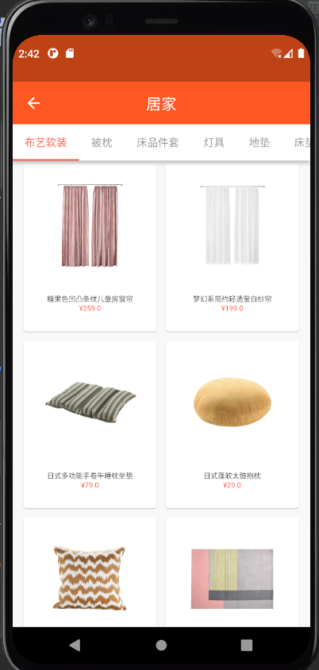
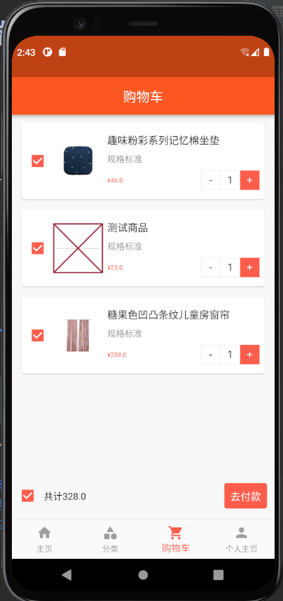
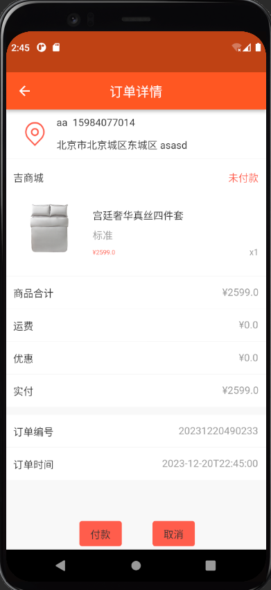
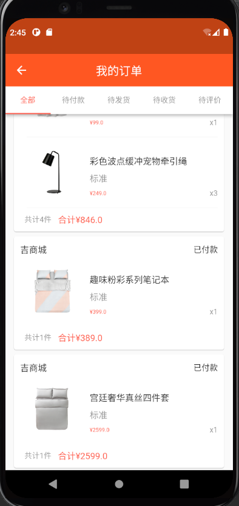
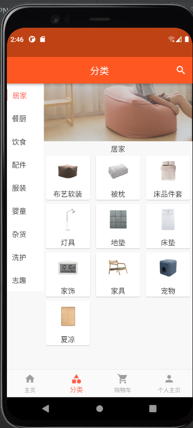
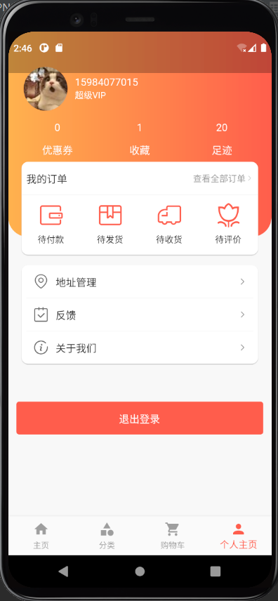
## 目前完成进度
1. 移动端界面完成
2. 后端管理界面完成
3. 前后端联调完成
4. 移动端界面优化未完成
5. 后端服务使用Redis缓存未完成

## 补充
1. 移动端界面是借鉴[new_flutter_mallprovider项目](https://github.com/lotawei/new_flutter_mallprovider)
项目，自己补充和修改了一些bug和适配flutter3的问题。
2. 后端的数据来自[litemall项目](https://github.com/linlinjava/litemall)
商品服务接口借鉴该项目的设计方法，使用mybatis-plus框架完成接口重构。
3. 管理端的后端和前端由我自己开发完成，后续会加入缓存优化项目。
4. 本项目从开发到完成1.0版本用时（11.10-12.20）
