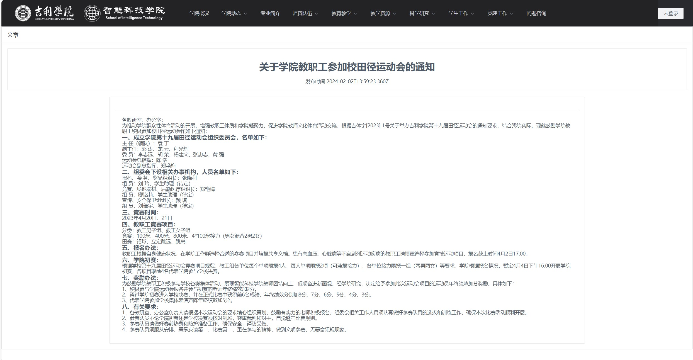

# 吉校园-前台项目

Ge-school：

前端：Vue框架
后端：Python Flask

## 项目地址
前端管理地址在分支 frontend [Ge-school项目](https://github.com/MA-douzhang/ge-school/tree/frontend-admin)

后端地址在分支 master [Ge-school项目](https://github.com/MA-douzhang/ge-school)

前端管理地址在分支 frontend-admin [Ge-school项目](https://github.com/MA-douzhang/GeEnglish)

## 项目展示

前台端界面

## 目前完成进度
1. 前端界面完成
2. 后端管理界面完成
3. 前后端联调完成
4. 前端界面登录有bug未改
5. 后端服务使用Redis缓存未完成

## 补充
1. 本项目从零开发，使用arco design pro框架开发
2. 后端的使用Python的Flask框架搭建，有简单的贴吧提问回复方式。
3. 管理端的后端和前端由我自己开发完成，后续会加入缓存优化项目。
4. 本项目从开发到完成1.0版本用时（1.26-2.9）
